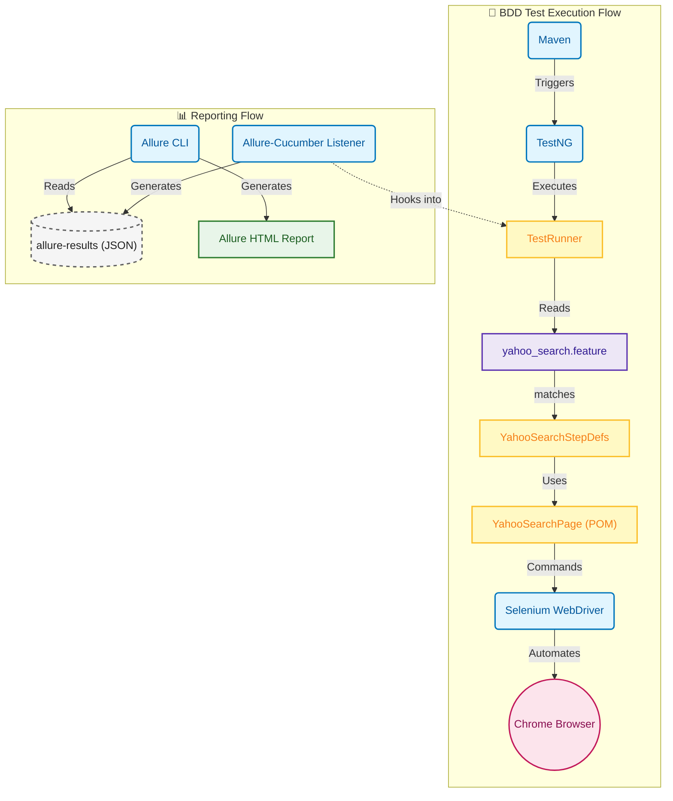

# Web UI Test Automation Framework (TAF) with BDD

This project is a Selenium-based test automation framework designed to test Yahoo Search functionality. It uses Java, Maven, TestNG, Cucumber for BDD, and Allure for reporting.

## Test Architecture Diagram



## Project Structure

```
Web-UI-TAF/
├── pom.xml                 # Maven configuration and dependencies
├── README.md               # Project documentation
├── src/
│   ├── main/
│   │   └── java/
│   │       └── ui/web/taf/
│   │           └── pages/
│   │               └── YahooSearchPage.java  # Page Object Model for Yahoo Search
│   └── test/
│       ├── java/
│       │   └── ui/web/taf/
│       │       ├── runner/
│       │       │   └── TestRunner.java       # Cucumber TestNG Runner
│       │       └── stepdefs/
│       │           └── YahooSearchStepDefs.java # Step Definitions
│       └── resources/
│           └── features/
│               └── yahoo_search.feature    # Cucumber Feature File
```

## Components

### 1. BDD Layer
- **`yahoo_search.feature`**: A plain-text file written in Gherkin that describes the test scenario.
- **`YahooSearchStepDefs.java`**: The Java implementation of the Gherkin steps. This class contains the core test logic and uses the Page Object Model.
- **`TestRunner.java`**: A TestNG class that runs the Cucumber features.

### 2. Page Object Model (`YahooSearchPage.java`)
- Encapsulates the mechanics of the Yahoo Search page.

### 3. Dependencies (`pom.xml`)
- **Cucumber**: For BDD capabilities.
- **Allure Cucumber**: For integrating Allure reports with Cucumber.

## How to Execute Tests

### Option 1: Using Maven Command Line
Run the tests from the project root:
```bash
mvn clean test
```

### Option 2: Using IDE
1.  Open `src/test/java/ui/web/taf/runner/TestRunner.java`.
2.  Right-click on the `TestRunner` class.
3.  Select **Run 'TestRunner'**.

## Generating and Viewing Allure Reports

After running the tests, Allure results are generated in the `target/allure-results` directory. To view the report:

1.  **Install Allure Commandline** (if not already installed).
2.  **Serve the Report**:
    ```bash
    allure serve target/allure-results
    ```
This will start a local web server and open the report in your default browser.
