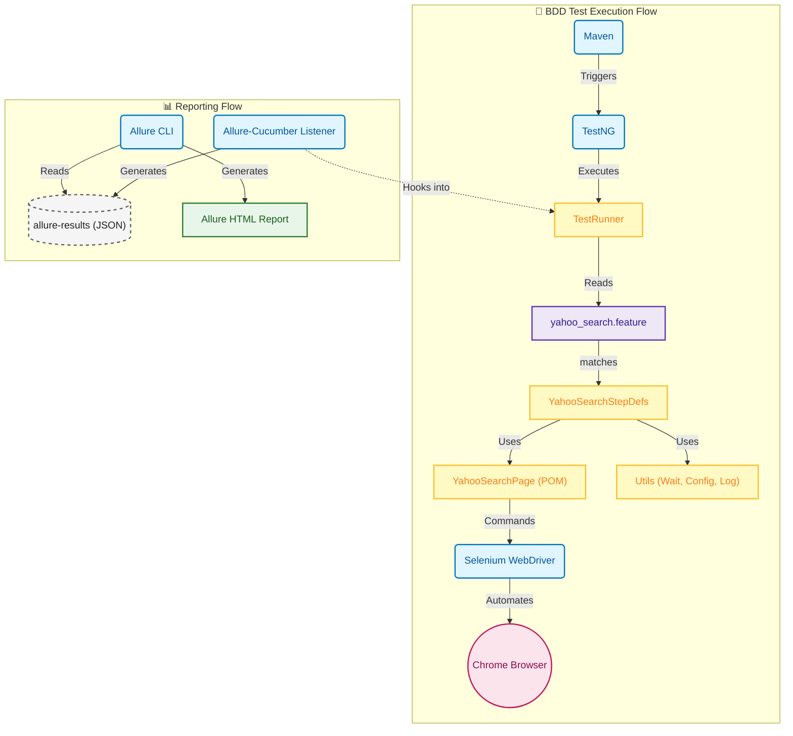

# Web UI Test Automation Framework (TAF)

This project is a comprehensive, enterprise-grade test automation framework designed for testing web applications. It leverages **Selenium WebDriver** for browser automation, **Cucumber** for Behavior-Driven Development (BDD), **TestNG** for test execution, and **Allure** for detailed reporting.

## Key Features

*   **BDD with Cucumber**: Write test scenarios in plain English (Gherkin) to bridge the gap between technical and non-technical stakeholders.
*   **Page Object Model (POM)**: Promotes code reusability and maintainability by separating test logic from page interaction logic.
*   **Robust Wait Strategies**: Includes a centralized `WaitUtils` class supporting Implicit, Explicit, and Fluent waits to handle dynamic web elements reliably.
*   **Comprehensive Reporting**: Integrated Allure reporting provides rich, interactive HTML reports with step-by-step logs and screenshots.
*   **Visual Debugging**: Automatically captures screenshots of specific elements during interactions and full-page screenshots upon assertion or failure.
*   **Environment Management**: Easily switch between environments (QA, Stage, Prod) using configuration files and system properties.
*   **Utility Library**: A suite of helper classes for common tasks like Logging, Date manipulation, CSV/Excel processing, and Database connectivity.

## Test Architecture Diagram



## Project Structure

```
Web-UI-TAF/
├── pom.xml                 # Maven configuration and dependencies
├── README.md               # Project documentation
├── src/
│   ├── main/
│   │   └── java/
│   │       └── ui/web/taf/
│   │           ├── pages/
│   │           │   └── YahooSearchPage.java  # Page Object Model (Main)
│   │           └── utils/                    # Utility Classes
│   │               ├── ConfigUtils.java      # Environment Configuration
│   │               ├── WaitUtils.java        # Centralized Wait Logic
│   │               ├── ScreenshotUtils.java  # Screenshot Capture
│   │               ├── LoggingUtils.java     # Standardized Logging
│   │               ├── ReportUtils.java      # Allure Reporting Helpers
│   │               ├── DateUtils.java        # Date/Time Helpers
│   │               ├── CSVUtils.java         # CSV File Handling
│   │               ├── ExcelUtils.java       # Excel File Handling
│   │               └── DBUtils.java          # Database Connectivity
│   └── test/
│       ├── java/
│       │   └── ui/web/taf/
│       │       ├── runner/
│       │       │   └── TestRunner.java       # Cucumber TestNG Runner
│       │       ├── stepdefs/
│       │       │   └── YahooSearchStepDefs.java # Step Definitions
│       │       └── pages/
│       │           └── YahooSearchPage.java  # Page Object (Test Specific)
│       └── resources/
│           ├── features/
│           │   └── yahoo_search.feature      # Cucumber Feature File
│           └── config.properties             # Default Configuration
```

## Prerequisites

1.  **Java JDK**: JDK 17 or higher is recommended.
2.  **Maven**: Ensure Maven is installed and added to your system PATH.
3.  **Google Chrome**: The tests are configured to run on Chrome.
4.  **Allure Commandline**: Required to view the generated reports locally.

## Configuration

The framework uses `src/test/resources/config.properties` for default settings.

```properties
browser=chrome
url=https://www.yahoo.com
implicit.wait=10
explicit.wait=10
headless=false
```

To run against a different environment (e.g., QA), create a `config-qa.properties` file and run with `-Denv=qa`.

## How to Execute Tests

### Option 1: Using Maven Command Line

Run all tests:
```bash
mvn clean test
```

Run with a specific environment config:
```bash
mvn clean test -Denv=qa
```

### Option 2: Using IDE (IntelliJ / Android Studio)

1.  Navigate to `src/test/java/ui/web/taf/runner/TestRunner.java`.
2.  Right-click on the `TestRunner` class.
3.  Select **Run 'TestRunner'**.

## Generating and Viewing Reports

After test execution, Allure results are generated in `target/allure-results`.

To view the report, run:
```bash
allure serve target/allure-results
```
This command will start a local web server and automatically open the interactive report in your default browser.

## Troubleshooting

*   **Browser Driver Issues**: Selenium 4.6+ uses Selenium Manager to automatically handle drivers. If you face issues, ensure your browser is up-to-date.
*   **Plugin Errors**: If you see `Could not load plugin class`, ensure your `TestRunner` references `io.qameta.allure.cucumber7jvm.AllureCucumber7Jvm`.
