# Web UI Test Automation Framework (TAF)

This project is a Selenium-based test automation framework designed to test Yahoo Search functionality. It uses Java, Maven, TestNG, and Allure for reporting.

## Test Architecture Diagram

```mermaid
graph TD
    %% Define styles for nodes
    classDef tool fill:#e1f5fe,stroke:#0277bd,stroke-width:2px,color:#01579b
    classDef code fill:#fff9c4,stroke:#fbc02d,stroke-width:2px,color:#f57f17
    classDef browser fill:#fce4ec,stroke:#c2185b,stroke-width:2px,color:#880e4f
    classDef report fill:#e8f5e9,stroke:#2e7d32,stroke-width:2px,color:#1b5e20
    classDef artifact fill:#f5f5f5,stroke:#616161,stroke-width:2px,stroke-dasharray: 5 5,color:#212121

    subgraph Execution ["🚀 Test Execution Flow"]
        Maven("Maven"):::tool -->|Triggers| TestNG("TestNG"):::tool
        TestNG -->|Executes| TestClass["YahooSearchTest"]:::code
        TestClass -->|Uses| POM["YahooSearchPage (POM)"]:::code
        POM -->|Commands| WebDriver("Selenium WebDriver"):::tool
        WebDriver -->|Automates| Browser(("Chrome Browser")):::browser
    end

    subgraph Reporting ["📊 Reporting Flow"]
        Listener("Allure Listener"):::tool -.->|Hooks into| TestNG
        Listener -->|Generates| Results[("allure-results (JSON)")]:::artifact
        CLI("Allure CLI"):::tool -->|Reads| Results
        CLI -->|Generates| Report["Allure HTML Report"]:::report
    end
```



## Project Structure

```
Web-UI-TAF/
├── pom.xml                 # Maven configuration and dependencies
├── testng.xml              # TestNG suite configuration
├── README.md               # Project documentation
├── src/
│   ├── main/
│   │   └── java/
│   │       └── ui/web/taf/
│   │           └── pages/
│   │               └── YahooSearchPage.java  # Page Object Model for Yahoo Search
│   └── test/
│       └── java/
│           └── ui/web/taf/
│               └── tests/
│                   └── YahooSearchTest.java  # Test cases
```

## Components

### 1. Dependencies (`pom.xml`)
- **Selenium Java (4.27.0)**: The core library for browser automation.
- **TestNG (7.10.2)**: The testing framework used for assertions, test configuration, and execution.
- **Allure TestNG (2.24.0)**: Generates comprehensive test execution reports.

### 2. Page Object Model (`YahooSearchPage.java`)
Located in `src/main/java/ui/web/taf/pages/`.
- Encapsulates the mechanics of the Yahoo Search page.
- Annotated with `@Step` to provide detailed logs in Allure reports.
- **`navigateTo()`**: Opens the Yahoo homepage.
- **`searchFor(String text)`**: Enters text into the search box and submits.
- **`getTitle()`**: Returns the current page title for verification.

### 3. Test Class (`YahooSearchTest.java`)
Located in `src/test/java/ui/web/taf/tests/`.
- Annotated with `@Epic`, `@Feature`, `@Story`, and `@Severity` for rich reporting metadata.
- **`@BeforeMethod setUp()`**: Initializes the `ChromeDriver` and the `YahooSearchPage` object before each test.
- **`@Test testYahooSearch()`**: The actual test case. It navigates to Yahoo, searches for "Selenium WebDriver", and asserts that the page title contains the search term.
- **`@AfterMethod tearDown()`**: Closes the browser after each test to ensure a clean state.

### 4. Test Configuration (`testng.xml`)
- Defines the test suite and lists the test classes to be executed.

## Prerequisites

1.  **Java JDK**: Ensure you have Java installed (JDK 11 or higher recommended).
2.  **Maven**: Ensure Maven is installed and added to your system PATH.
3.  **Google Chrome**: The tests are configured to run on Chrome.
4.  **Allure Commandline**: Required to view the generated reports locally (optional if using CI/CD plugins).

## How to Execute Tests

### Option 1: Using Maven Command Line

You can run the tests using the Maven `test` lifecycle. Open your terminal or command prompt in the project root directory (`C:/Workspaces/Web-UI-TAF/`) and run:

```bash
mvn clean test
```

This will compile the code and execute the tests defined in the project.

### Option 2: Using TestNG XML

You can run the specific suite defined in `testng.xml`.

**From Command Line (via Maven):**
```bash
mvn clean test -DsuiteXmlFile=testng.xml
```

**From IDE (IntelliJ/Android Studio):**
1.  Right-click on `testng.xml`.
2.  Select **Run 'C:/Workspaces/Web-UI-TAF/testng.xml'**.

### Option 3: Running Individual Tests in IDE

1.  Open `src/test/java/ui/web/taf/tests/YahooSearchTest.java`.
2.  Click the green "Run" icon next to the class name or the specific test method.

## Generating and Viewing Allure Reports

After running the tests, Allure results are generated in the `target/allure-results` directory. To view the report:

1.  **Install Allure Commandline** (if not already installed).
    -   Mac: `brew install allure`
    -   Windows: `scoop install allure` or download from [Maven Central](https://repo.maven.apache.org/maven2/io/qameta/allure/allure-commandline/).

2.  **Serve the Report**:
    Run the following command in the project root:
    ```bash
    allure serve target/allure-results
    ```
    This will start a local web server and open the report in your default browser.

## Troubleshooting

-   **ChromeDriver Issues**: Selenium 4.6+ includes "Selenium Manager" which automatically handles browser drivers. If you encounter driver issues, ensure your Chrome browser is up to date.
-   **Compilation Errors**: Run `mvn clean install` to ensure all dependencies are downloaded correctly.
